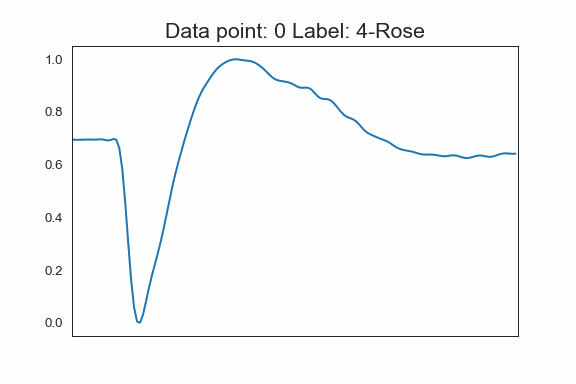

# Odors_identity_controls_robot_movements
Classification of odors by M.L Models, and control of a robot that travels depending on the odor received, the data is collected by an odor sensor developed in the Neuroscience Laboratory, at Tel Aviv University.

Describing different odors using a graph:

